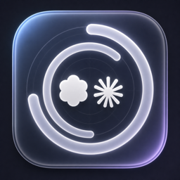

# Usage Radar



**Usage Radar is a small macOS menu bar app for checking Codex and Claude usage at a glance.**

If you use Codex and Claude heavily, one of the most repeated micro-actions is checking how much quota is left: open the app, find the usage page, wait for the dialog, compare the 5-hour window and the weekly window, then do it again later. Usage Radar turns that into one glance in the menu bar.

Menu bar format:

```text
Codex 5h/7d · Claude 5h/7d
```

For example, `98/99 · 100/74` means Codex has 98% left in the 5-hour window and 99% left in the weekly window, while Claude has 100% left in the 5-hour window and 74% left in the weekly window.

## 中文简介

**Usage Radar 是一个 macOS 菜单栏小工具，用来直接查看 Codex 和 Claude 的用量。**

Codex 和 Claude 高频使用时，最烦的小动作就是反复看额度：打开页面、找 usage、看 5 小时百分比、看 7 天百分比，再切回来继续工作。Usage Radar 把这件事放到菜单栏里，Codex / Claude 的 5 小时和 7 天剩余额度一眼可见。

核心解决的问题：

- 不用反复打开 Codex 或 Claude 的用量弹窗
- 不用手动比较 5 小时窗口和 7 天窗口
- 菜单栏直接显示 Codex + Claude 的四个剩余百分比
- 可以显示桌面小窗，保留毛玻璃圆环视觉
- Claude 支持连接账号后读取官方用量百分比

## Features

- **Menu bar usage radar**: Codex and Claude remaining percentages stay visible while you work.
- **Four key numbers**: Codex 5-hour, Codex 7-day, Claude 5-hour, Claude 7-day.
- **Desktop glass widget**: optional stacked mini panel with circular remaining-quota rings.
- **Provider display modes**: show both providers, only Codex, or only Claude in the menu bar.
- **Manual refresh**: refresh directly from the menu bar or the settings window.
- **Claude sync**: connect Claude once through OAuth to sync official usage percentages.
- **Local-first design**: stores tokens locally under `~/Library/Application Support/QuotaRadar`.
- **WidgetKit target included**: native macOS widget code is included, but proper Apple signing is required for the system widget gallery.

## Installation

Download the latest DMG from GitHub Releases, open it, drag **Usage Radar.app** into **Applications**, then launch it.

Detailed English and Chinese installation instructions are in [INSTALL.md](INSTALL.md).

## Data Sources

Usage Radar reads usage data locally and through official authenticated endpoints where available.

- **Codex**: first reads the official ChatGPT/Codex usage API using your local `~/.codex/auth.json` login token. If that fails, it falls back to local Codex session logs and the newest `token_count.rate_limits` event.
- **Claude**: first calls Anthropic's OAuth usage endpoint after you connect a Claude account in Usage Radar. If that is unavailable, it can fall back to Claude Code credentials read-only, then to the optional Claude Code status line cache, and finally to local token counts.

Usage Radar does not send your tokens to a third-party server. OAuth and cache files stay on your Mac.

## Claude Sync

Recommended path:

1. Open **Usage Radar**.
2. Click **连接 Claude 账号**.
3. Approve in the browser.
4. Paste the authorization code back into Usage Radar.
5. Click refresh.

Optional fallback for Claude Code terminal users:

```json
{
  "statusLine": {
    "type": "command",
    "command": "/Users/YOUR_NAME/.claude/quota-radar-statusline.sh",
    "padding": 0,
    "refreshInterval": 30
  }
}
```

The fallback writes:

```text
~/Library/Application Support/QuotaRadar/claude-rate-limits.json
```

## Build From Source

Requirements:

- macOS 14+
- Xcode
- Swift
- XcodeGen

```bash
xcodegen generate
swift test
xcodebuild -project QuotaRadar.xcodeproj \
  -scheme QuotaRadar \
  -configuration Release \
  -destination 'generic/platform=macOS' \
  ARCHS="arm64 x86_64" \
  ONLY_ACTIVE_ARCH=NO \
  build
```

CLI:

```bash
swift run usage-radar
swift run usage-radar claude-login
swift run usage-radar claude-usage-raw
```

## Release Package

Current package names:

```text
dist/UsageRadar-1.1-macOS.dmg
dist/UsageRadar-1.1-macOS.zip
```

Verification:

```bash
swift test
hdiutil verify dist/UsageRadar-1.1-macOS.dmg
codesign --verify --deep --strict --verbose=2 "/Applications/Usage Radar.app"
```

## Privacy Notes

- Codex auth is read from your existing local Codex login.
- Claude OAuth is stored locally at `~/Library/Application Support/QuotaRadar/claude-oauth.json`.
- Claude Code credentials, when used as fallback, are read-only.
- Generated snapshots are stored in the app group cache for the app and widget.
- No analytics, no external backend, no telemetry.

## 中文安装

中文安装步骤见 [INSTALL.md](INSTALL.md#中文安装说明)。
